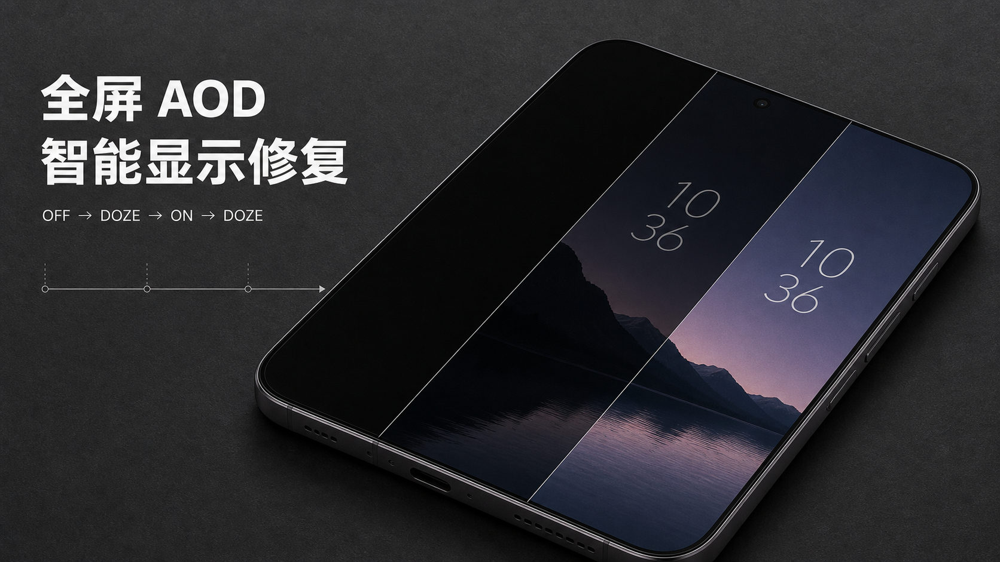

# 解决米系手机强开全屏AOD后智能显示失效的问题



## 现象

小米从 15 系开始正式提供全屏 AOD，息屏后可以保留与锁屏界面接近的壁纸和样式。一些较早的机型也带有相关的系统框架代码，只是机型特性文件没有声明这项能力。

以小米 14 Pro 为例，原厂 `/product/etc/device_features/shennong.xml` 中没有全屏 AOD 项，官改包加入了下面这行：

```xml
<bool name="support_aod_fullscreen">true</bool>
```

小米 15 Pro 的 `/product/etc/device_features/haotian.xml` 原生带有相同配置。`support_aod_fullscreen` 是机型能力开关，系统据此开放全屏 AOD 的界面和执行路径；用户开启功能后，选择状态保存在安全设置 `full_screen_aod_on` 中。官改包和功能补全模块的核心工作，就是为对应机型补上这项 XML 配置，并让设置入口能够写入运行时开关。

强制开启后，第一次锁屏通常可以正常显示，亮度也符合当时的环境。智能显示因为遮挡、暗光或无人注视而关闭屏幕后，条件恢复时 AOD 可能一直保持黑屏。切回普通 AOD，同样的遮挡和注视操作可以正常熄灭和恢复。

实机日志显示，传感器、注视判断和 AOD 内容恢复均在正常运行，系统也持续算出了新的息屏亮度。故障发生在亮度写入屏幕的最后一步。

本文使用小米 14 Pro 完成取证和验证，相关链路属于米系设备共用的显示框架，因此同类机型出现相同症状时也可以参考这套分析。

## 普通 AOD 与全屏 AOD 的亮度通道

屏幕在这段流程中会经过三个物理状态。ON 对应正常亮屏，OFF 对应面板关闭，DOZE 位于两者之间，用较低刷新率和功耗维持息屏画面。

传统 AOD 显示的内容较少，小米为它设置了专用的息屏亮度通道。环境光最终被归入高、低两档，再通过显示功能 mode 25 交给驱动。驱动直接处理“息屏高亮”和“息屏低亮”命令，面板处于 DOZE 时也可以完成档位切换。

全屏 AOD 会显示壁纸和完整锁屏样式，对亮度过渡的要求更高。系统里的 `DozeAutoBrightnessController` 根据环境光计算连续的目标亮度，再通过通用背光通道写给屏幕。

`LocalDisplayAdapter.setDisplayBrightness()` 中的这处分支展示了两条通道的选择过程：

```java
if (!isFullAodState(displayId) && isDoze(mState)) {
    updateDozeBrightness(physicalDisplayId, brightness); // mode 25，高低两档
} else {
    mBacklightAdapter.setBacklight(...);                 // 通用连续亮度
}
```

普通 AOD 的实机日志与反编译结果一致，mode 25 在高、低两个状态之间切换：

```text
DisplayFeatureManagerService: mode=25 value=1
DisplayFeatureHal: DOZE_BRIGHTNESS_STATE modeId=1

DisplayFeatureManagerService: mode=25 value=2
DisplayFeatureHal: DOZE_BRIGHTNESS_STATE modeId=2
```

内核收到 mode 25 后会调用专用的 `mi_dsi_panel_set_doze_brightness()`，向面板发送 `doze_brightness_low`、`doze_brightness_high` 或 `doze_to_normal` 命令。这条通道不依赖 LP1 状态下的普通背光写入，因此普通 AOD 即使同时出现普通背光被跳过的日志，仍然可以正常熄灭和恢复。

两档限制来自传统 AOD 的控制接口。面板本身可以保持更多亮度等级：第一次进入全屏 AOD 时，系统会在正常亮屏状态写入一个连续 DBV，面板进入 DOZE 后可以继续保持这个值。

## 第一次锁屏和智能显示恢复的时序差异

第一次锁屏时，面板仍处于 ON。系统先写入自动亮度控制器算出的目标值，随后直接把面板切入 DOZE/LP1。这个过程没有经历面板关闭和 DBV 清零，LP1 会保留进入前已经生效的亮度，因此画面可以正常显示。第一次可见不代表进入 LP1 后的新亮度写入已经成功。

```text
第一次锁屏：ON → 写入连续亮度 → DOZE
```

智能显示关闭 AOD 后，面板会进入 OFF，普通背光和面板 DBV 随之清零。再次满足显示条件时，原系统先把面板从 OFF 切到 DOZE/LP1，随后再通过通用背光通道写连续亮度：

```text
智能显示恢复：OFF → DOZE → 写入连续亮度
```

原厂用户态显示库会在第二种时序中先拦截部分请求，日志给出了直接证据：

```text
HWPeripheralDRM::SetPanelBrightness:
Power state 1 pending or aod layer 0!
Skip for setting brightness 48 level
```

这里的 `aod layer 0` 和 pending power state 是用户态 composer/HWC 的检查条件。为了确认这是否是唯一阻断点，实验又修改了 `libsdmdal.so` 中的拒绝分支。补丁生效后，原来的 `Skip for setting brightness` 变成了实际设置日志：

```text
DisplayBuiltIn::SetPanelBrightness:
Setting display 67 brightness to level 21 (0.119049 percent)
```

紧随其后的内核日志却显示，N2 面板已经进入 LP1，普通背光请求在 `msm_drm` 中被第二次拒绝：

```text
mi_disp:dsi_panel_set_lp1 [msm_drm]: DSI_CMD_SET_LP1
mi_disp:is_backlight_set_skip [msm_drm]:
[primary] skip set backlight 28 due to LP1 on
```

用户态的 level 21 和内核的 backlight 28 经过了不同亮度标度之间的转换。两组日志的时间和后续连续亮度序列一致，证明请求在补丁后已经穿过用户态显示栈，并在内核 `is_backlight_set_skip()` 中被丢弃。sysfs 的 `brightness` 节点仍会保存请求值，但内核没有继续发送对应的面板普通背光命令。

因此故障并非只由一处 HAL 判断造成。小米 14 Pro 的恢复路径至少有两道门：原厂用户态显示库检查电源状态和 AOD 图层，N2 面板对应的内核驱动又禁止在 LP1 中写普通背光。此时 AOD 内容已经由 SurfaceFlinger 正确合成，系统截图也能完整看到壁纸、时钟和通知，缺少的只是让物理面板重新发光的非零 DBV。

小米 15 Pro 的差异也不只在上层开关。两机的 AOD 自动亮度和 framework 分流代码基本相同，内核中也都保留了 LP1 背光保护；但 15 Pro 实际使用的 O2 面板不在该拒绝条件覆盖的面板列表中，同时驱动还提供 `fullscreen_aod_status` 和全屏 AOD 的面板状态处理。14 Pro 实机使用 N2 面板，正好命中 LP1 普通背光拒绝条件，也没有 15 Pro 那套完整的全屏 AOD 驱动配合。

## 用户态显示库补丁的尝试

根据 `libsdmdal.so` 的反汇编结果，偏移 `0x53F44` 处是一条 AArch64 无条件跳转。原始指令进入拒绝路径，修改后会进入后续亮度设置路径：

```text
偏移：0x53F44
原始：04 00 00 14    b 0x53f54，进入拒绝路径
修改：19 00 00 14    b 0x53fa8，进入后续设置路径
```

原始跳转会在 `libsdmdal.so` 识别到特定内部状态和非零目标亮度时进入拒绝路径。改动这四个字节后，到达该位置的调用会继续执行后面的亮度设置代码，因此它解决的是 `libsdmdal.so` 内这一处分支拦截。这里修改的是 vendor 分区中的用户态共享库，不是 Linux 内核，也不是面板固件。

实机验证表明补丁确实让用户态显示栈从 `Skip` 进入 `Setting display brightness`，亮度请求随后到达 N2 内核驱动。但内核检测到面板处于 LP1 后，仍由 `is_backlight_set_skip()` 拒绝请求，所以屏幕依旧保持黑屏。四字节补丁只打开了第一道门，单独使用不会改善 AOD。

这个补丁还会无条件绕过目标内部状态 1/2 的拒绝分支，没有限定只在全屏 AOD 的恢复边沿放行，影响范围过大，不适合长期常驻。若沿底层补丁路线继续处理，必须同时对用户态 HAL 和 N2 内核做仅限全屏 AOD 的条件放行，再验证面板在 LP1 中动态接收连续 DBV 的安全性。相比之下，直接在恢复边沿复用面板本来就支持的 ON 状态写入能力，改动边界更清楚。

## 复用传统 AOD 亮度通道的尝试

另一项实验把全屏 AOD 接到传统 AOD 的 mode 25 通道。因为专用 doze 命令可以在 LP1 中生效，屏幕能够重新出现；但亮度随之退化为高、低两档，连续控制器的数值还会遇到阈值和单位不一致。最终方案继续使用全屏 AOD 原有的连续亮度计算和通用背光通道。

## 修复方法

第一次锁屏已经提供了一条可工作的顺序。智能显示恢复时短暂复现“在 ON 状态写亮度，再进入 DOZE”的过程，可以同时避开用户态的错误状态检查和 N2 内核的 LP1 普通背光限制，并保留小米原有的环境光计算结果。

模块采用纯事件驱动，共安装四个 Hook：

`DozeBrightnessStrategyImpl.updateAodMode()` 在全屏 AOD 设置发生变化时触发，模块由此缓存当前模式；`DozeAutoBrightnessController.updateAutoBrightness()` 在系统完成一次环境光计算时触发，模块缓存最终浮点亮度；`LocalDisplayAdapter` 内部的 `setDisplayState()` 在物理屏幕切换状态时触发，用于记录真实的 OFF→DOZE 恢复边沿；同一对象的 `setDisplayBrightness()` 在系统提交亮度时触发，并在刚才记录的边沿执行一次修正。

四处 Hook 都由系统原有函数调用触发，事件之间模块处于空闲状态。16 毫秒等待发生在修正事件内部，每次显示恢复执行一次。

修正过程如下：

```text
OFF → DOZE → 临时 ON → 写入最新亮度 → 等待 16 ms → DOZE
```

`SurfaceControl` 会异步把电源状态和亮度事务提交给 HWC。临时 ON 会让面板退出 LP1，随后用户态显示栈和 N2 内核都可以沿正常亮屏路径接受连续亮度。写入后保留 16 毫秒的提交窗口，可以让亮度事务在返回 DOZE 前完成。早期测试在写入后立即返回 DOZE，日志显示 DOZE 请求先到达，随后处理的亮度再次遇到 pending 状态；加入提交窗口后，顺序稳定为 ON 完成、亮度生效、DOZE 完成。

环境光变化会继续触发系统原有的自动亮度事件，模块随之更新缓存。物理 ON→DOZE 操作绑定在下一次 OFF→DOZE 恢复边沿，每次显示恢复执行一次。AOD 保持显示期间，面板维持本次写入的亮度；下一次隐藏并恢复时，再使用当时最新的环境亮度。这样实现了按显示事件更新的连续亮度，并控制了额外的面板状态切换次数。

普通 AOD 会沿 mode 25 通道运行，正常亮屏也沿原有背光策略运行。模块的触发条件包含全屏 AOD 标志、OFF→DOZE 边沿和有效的正亮度，三项同时满足才会执行修正。

## 适用范围

模块通过 Java Hook 调整 framework 的显示恢复顺序，使用相同类、方法和字段结构的 HyperOS 版本都可以尝试。

目前验证环境为小米 14 Pro（`shennong`）、Android 16、`OS3.0.307.0.WNBCNXM`，MIUI AOD 版本号 `22335101`。使用前需要先在机型特性 XML 中启用全屏 AOD。

## 使用方法

模块需要 root、LSPosed 和支持 libxposed API 101 的管理器。安装后在 LSPosed 中启用模块，作用域选择“系统框架（System Framework / system）”，然后重启设备。

模块下载：[GitHub Releases](https://github.com/silverpoetry/hyperos-full-aod-bridge/releases)

开源地址：[hyperos-full-aod-bridge](https://github.com/silverpoetry/hyperos-full-aod-bridge)
